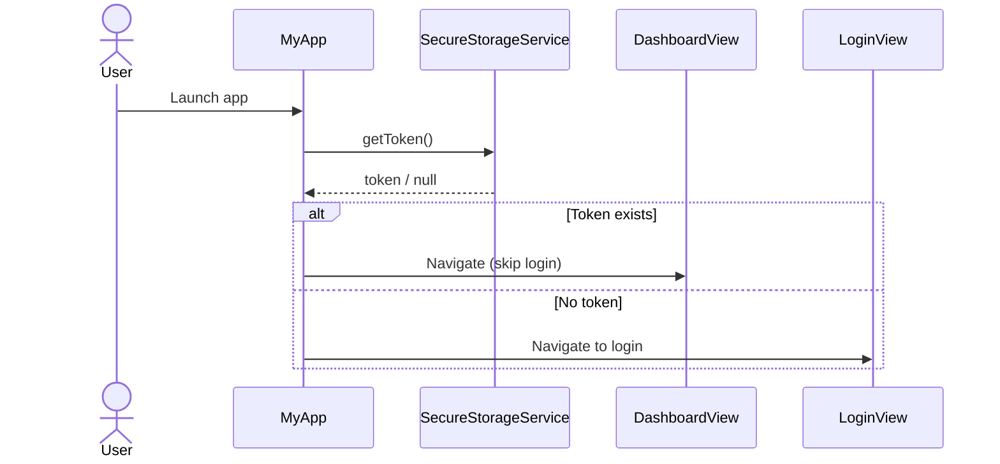
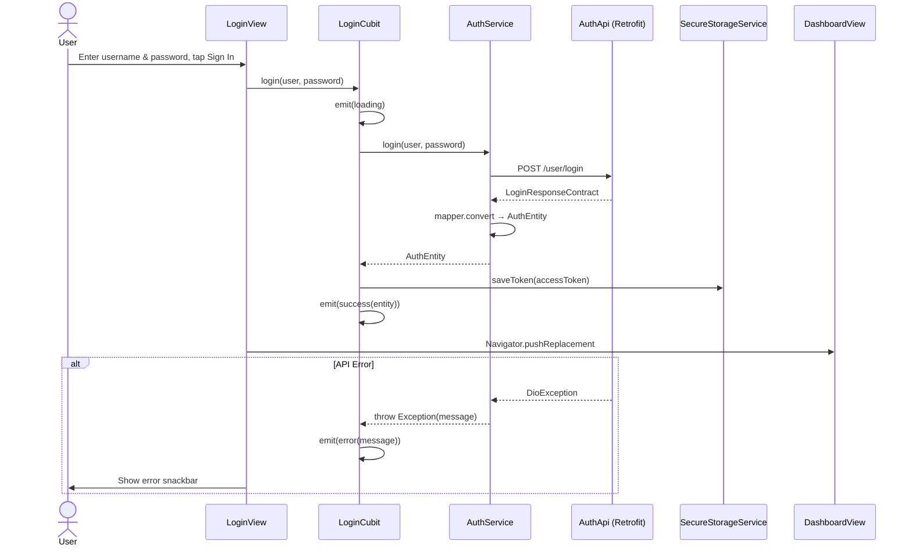
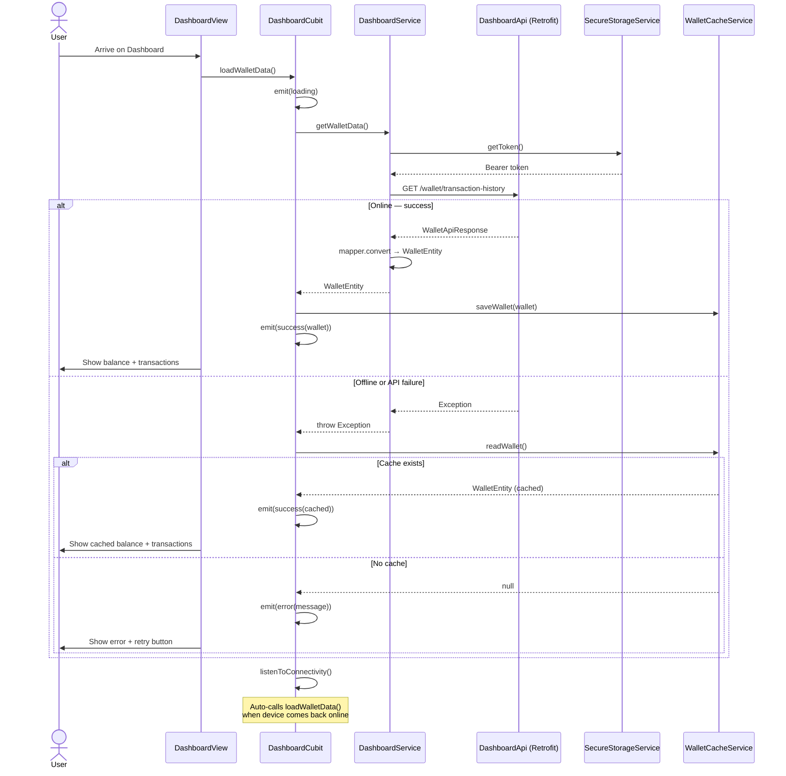
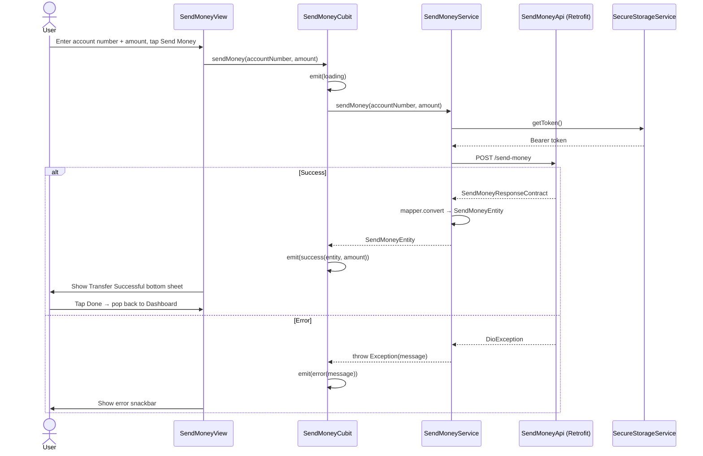
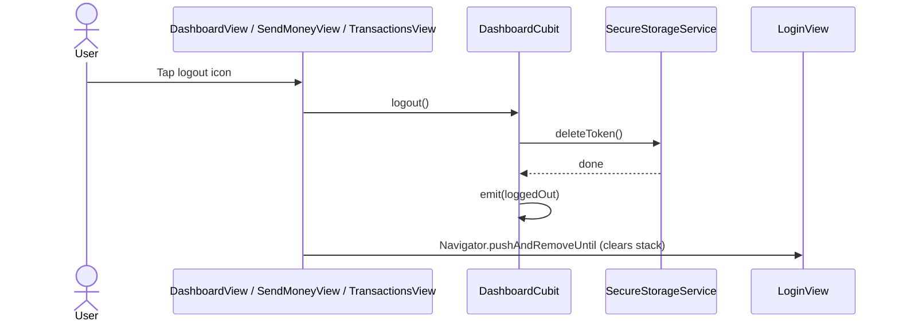

# PadalaQ — Design Documentation

## Architecture Overview

PadalaQ follows **Feature-First Clean Architecture** with three strict layers per feature:

```
presentation  →  domain  →  data
```

- **`data`** — API clients (Retrofit), request/response contracts (JSON serializable). Knows nothing about the UI.
- **`domain`** — Business entities (Equatable), mappers (AutoMappr), and service interfaces + implementations. Owns all business logic.
- **`presentation`** — Cubits (BLoC), Freezed states, and Views. Only talks to domain services, never to APIs directly.

Dependency flow is one-directional and enforced: `presentation` can call `domain`, `domain` can call `data`, but never the reverse.

Cross-cutting concerns live in `core/`:
- `core/storage` — `SecureStorageService` (token persistence via flutter_secure_storage)
- `core/cache` — `WalletCacheService` (offline data via SharedPreferences)
- `core/network` — `DioProvider`, `AppModule` (DI wiring)
- `core/theme` — Design system tokens (colors, text styles, button styles)

---


## Sequence Diagrams

### 1. App Launch — Token Check & Auto Login



---

### 2. Login Flow



---

### 3. Dashboard Load — Online & Offline



---

### 4. Send Money Flow



---

### 5. Logout Flow


